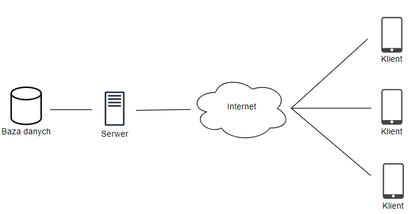
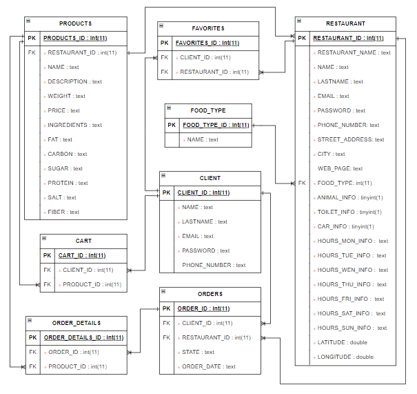
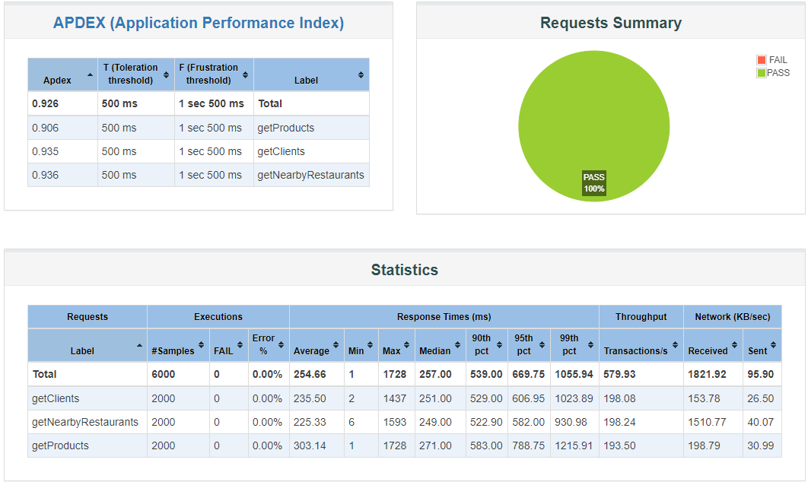

## About

IT system supporting the search for information on catering establishments, based on the user's location. The application has the ability to maintain accounts by both the client and the restaurants. On the basis of the menu items entered by the restaurant, the customer can send to the restaurant orders placed from items previously added to the cart. The system allows the second type of accounts, maintained by restaurants, the option to enlarge and modify the current offer. It can also accept or reject orders it receives from customers.

## Architecture

The application architecture is based on a client-server network communication model. This gives us many advantages, such as location independence (since the server is a process residing on the same network on which the client runs), scalability of the application (adding new devices on which the executed program runs does not affect the performance of the system), or the fact that all information is stored on the server, which allows better data security. However, the use of such a model can also result in a large number of clients trying to receive data from a single server, causing bandwidth problems.

## Database

The database was designed using general principles. The main structuring process was the normalization rule. It ensures that consistency is maintained and that excessive duplication of information is avoided.

## Server

The server was designed using Spring Boot. To best separate the parts of the server's business logic from its data-fixing layer, it is divided into three packages: Model, Controllers, and Repositories.

## Load tests

Load tests were performed with the help of Apache JMater. Based on the obtained results, it is possible to assess how the application will respond to different application usage scenarios. The Apache JMeter tool performed 6,000 tests, which sent three types of queries to the server serving the database:
- getClients: in response, the data of all customers registered in the database was gained,
- getProducts: the response gained the data of all products offered by the re-
stations,
- getNearbyRestaurants: in response, data on all restaurants were gained,
which are located within a preset distance from the user.

The tool measured the time it took to get a response from the server and the number of attempts that failed.

